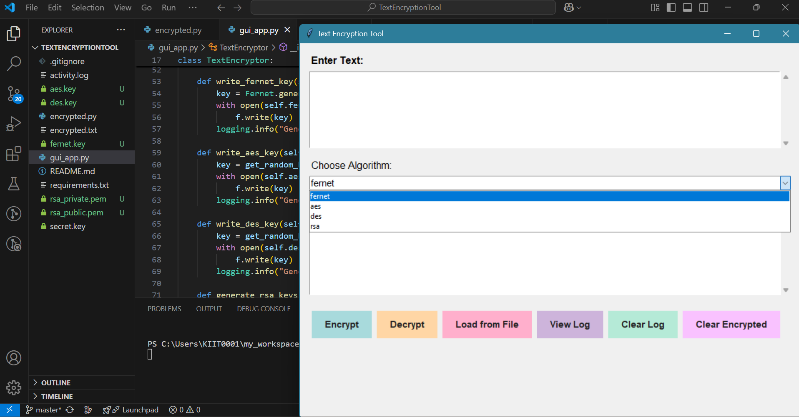
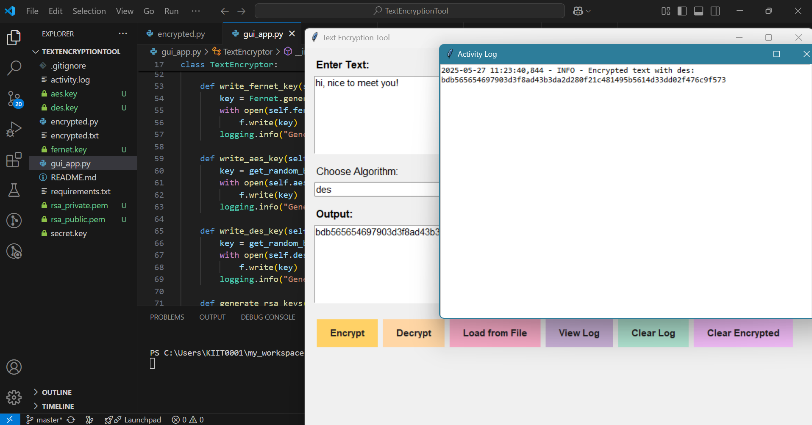

#**Text Encrypter 💻✨**

👉 A Python-based cybersecurity tool for encrypting and decrypting text using three major encryption algorithms: AES (via Fernet), DES, and RSA. The application supports both command-line and graphical user interfaces (GUI) for secure and user-friendly text encryption.

👉 ##**Features:** 

📌 Supports three encryption algorithms:

  --AES (via Fernet)
  
  --DES (Data Encryption Standard)

  --RSA (Rivest–Shamir–Adleman)

📌 Encrypt plain text and save to encrypted.txt

📌 Decrypt encrypted text either from input or file

📌 Automatically manages secret keys and RSA key pairs

📌 GUI built with Tkinter for easy interaction

📌 Command-line support for quick usage

📌 Logging of all encryption/decryption activity (activity.log)

📌 Option to clear logs and encrypted data

App preview 

👉 ##**STEPS :**

### 1. Installation Clone the repository:✨

🔗 git clone "https://github.com/ShaborniS/text-encrypter.git"

Navigate to the project directory:

-- "cd text-encrypter"

Install the required Python packages:

-- "pip install -r requirements.txt"

### 2. Usage✨

🖥 <u>Command Line</u>

You can run the script to encrypt or decrypt via terminal (to be implemented or documented).

🪟 <u>GUI</u>

Run the GUI application:
python gui_app.py

Select the algorithm (AES, DES, RSA), enter your text, and choose to Encrypt or Decrypt.

### 3. File Structure✨

-- gui_app.py — Main GUI interface for encryption/decryption

-- crypto_algorithms:

A. aes_module.py — AES encryption using Fernet

B. des_module.py — DES encryption/decryption

C. rsa_module.py — RSA encryption/decryption

-- encrypted.txt — File storing the latest encrypted text

-- secret.key — AES (Fernet) key

-- rsa_public.pem & rsa_private.pem — RSA key pair

-- activity.log — Logs of encryption/decryption events

-- requirements.txt — Python dependencies
